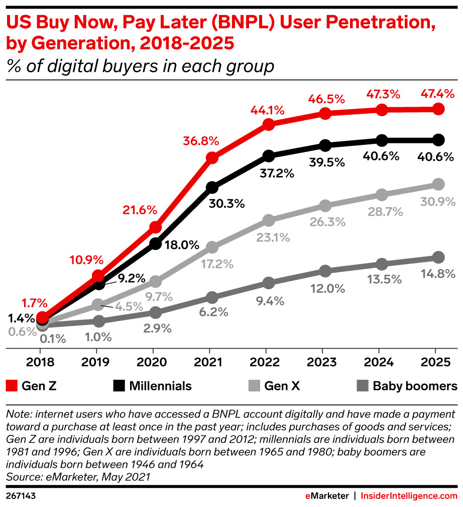
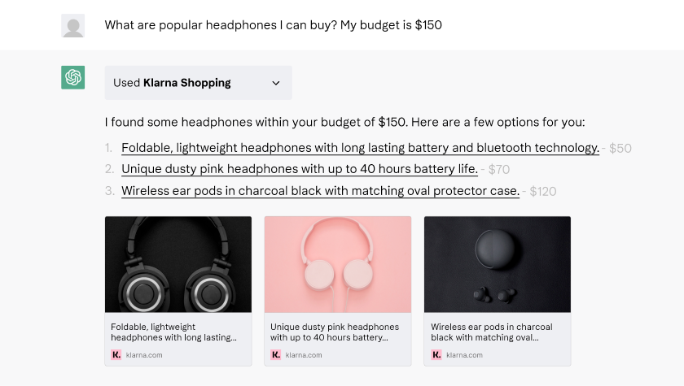
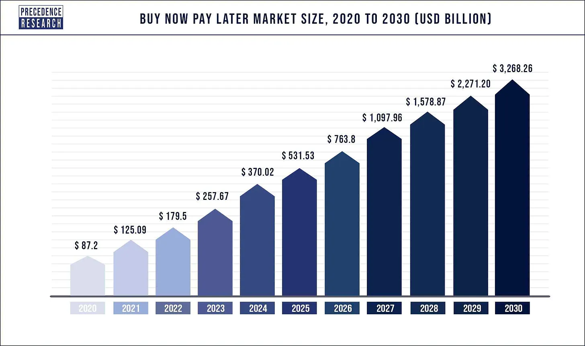
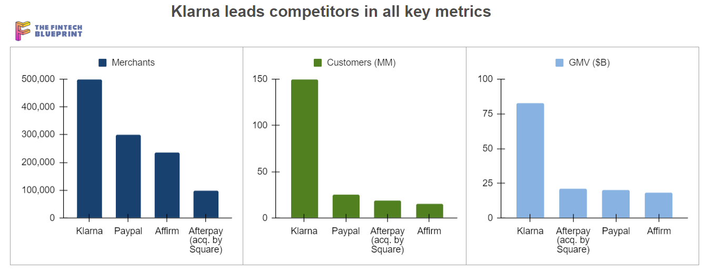
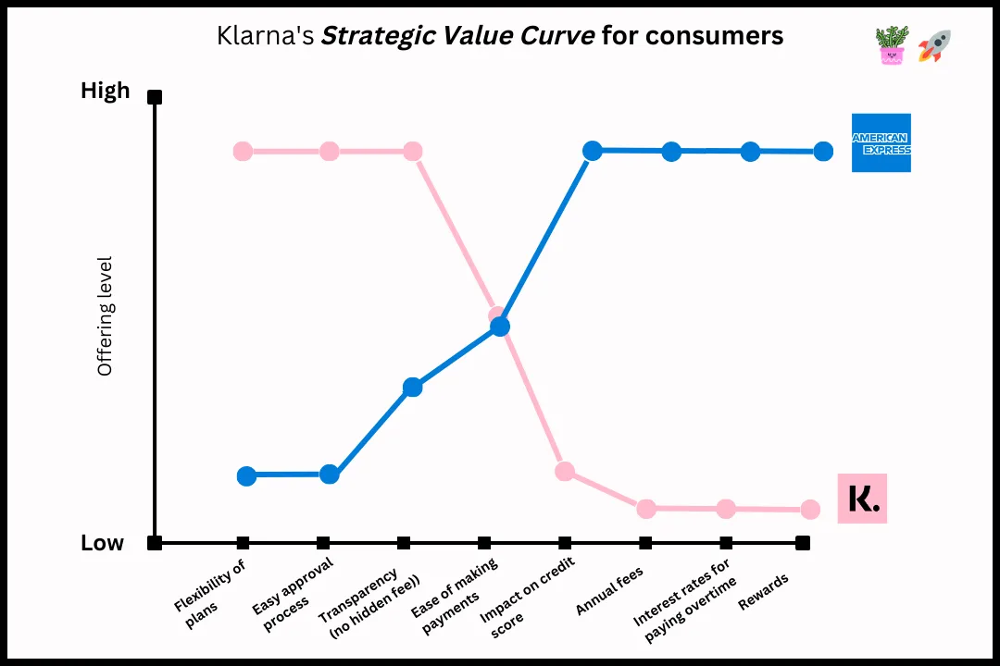

# Business Case of FinTech Domains - Klarna 

---

## Overview and Origin
___ 

` The focus of this business case is in the Payments sector within the FinTech domain, and the company under consideration is Klarna.`  
*Klarna* was incorporated in 2005 in *Stockholm, Sweden*.The founders of the FinTech business are *Sebastian Siemiatkowski, Niklas Adalberth, and Victor Jacobsson*.  
Initially, the founders' concept faced a not enthusiastically response when they presented it during the *Stockholm School of Economics* annual entrepreneurship award in 2005, which adopted a format similar to *Shark Tank*. The event marked the beginning of Klarna's journey as a *FinTech* player in the Payments niche. 
*Klarna* possesses support from 77 investors and successfully obtained significant funding through multiple investment rounds. Notable contributions have been made by *Venture Capital firms* and strategic investors, including the *Canada Pension Plan Investment Board* and *Spring St. Group.* To date, Klarna has raised the amount to $4.5B.

## Business Activities
___
The innocative swedish firm aims to provide a shopping process that ensure a positive experience for customers, incorporating elements such as flexibility and agility into the shopping experience. 
The platform empowers customers to decide when and how they want to pay. In addition, as a regulated bank known for its `“buy now,pay later”`model, it offers shoppers **interest-free** financing for retail purchases over a period of instalments. 
The widely used financial service is called `"Pay in 4,"` allowing customers to split their payments into four parts without any interest. Anyone over 18 can use this service, and the corporation has seen more interest from `Generation Z` and young adults due to their increased spending power. These age groups are looking for flexible payment options. 
According to the company, over 61% of the individuals aged 18 to 24 stated that they utilized a **Buy Now-Pay Later (BNPL)** service in 2021. This marks a significant increase from the roughly **38% reported in a prior survey conducted in 2020.** 
This pattern underscores the increasing popularity and adoption of Klarna' **payment choices among the younger demographic, pointing to a significant market potential.

As of November 2023, the business' market presence correspond to **150 million active users** globally, with **2 million** transactions daily. This includes a network of 500,000 retail partners, and a customer base of 37 million. In the US alone, *Klarna* collaborates with **26,000 retail partners**, featuring names as *Macy's, Nike, AirBnb, Instacart, and recent additions like StubHub, Timex, and Cole Haan.*  
While Klarna is recognized as a pioneer in the *BNPL* sector, the company provides consumers with the flexibility to split their payments into **interest-free installments**, often with a simple and straight forward application process. This flexibility appeals to customers who may prefer to manage their budgets by spreading the cost of purchases over time.  
A variety of online retailers have formed partnerships with a wide range of online payment services, integrating the payment service directly into the checkout process of these merchants. This seamless integration makes it easy for consumers to choose the payment service as an option when making purchases online. 
Klarna' US expansion is fueled by its investment in **AI**. In October 2023, they introduced new features, including an **in-app AI** shopping lens for visual search. The Klarna app also features an AI-powered discovery shopping feed, recommending products based on personal interests. Additionally, **machine-learning algorithms** analyze real-time transaction data to detect and flag potential fraud.  
 *resource: klarna.com*

New features for US consumers include in-store barcode scanning for instant access to details on over 10 million items. Collaborating with *Blackhawk Network*, a *Gift Card Store* has been introduced. The platform also offers tools for mindful shopping, including sustainability certification filters and a dedicated conscious shopping dashboard.

*resource: klarna.com*

## Landscape

___
*Klarna AB*, widely known as *Klarna*, is a *FinTech* firm specializing in the `payments sector`. It provides online financial services customized for *e-commerce* platforms, covering both direct payments and post-purchase payment solutions. 
In 2007, when smartphones were introduced, they changed the way we do things, especially in online payments. This important moment led to fast and big improvements in how we use mobile payments and technology. The rise of *mobile wallets, mobile Point of Sale (POS), Near-field communication (NFC), Mobile P2P transfers*, *in-app payments*, and other innovations played a big role in the rapid growth that happened in a short time. 
Moreover, in 2009, Bitcoin was introduced as the world's first digital currency, leveraging *blockchain* technology for its inception. **Cryptocurrency**, a decentralized form of digital money, emerged as a result. In the Payment domain, several other major companies like *PayPal, Apple Pay, Amazon Pay, Square, Stripe, and Sezzle* have also made significant contributions and advancements. 
## Results
___
Since its start in 2005, the three founders came up with a payment platform idea. They wanted to make online shopping `easier and safer`, especially because, back in the early 2000s, online shopping was new, and many people worried about *fraud*. The founders aimed to increase trust by making online payments flexible and secure, so people wouldn't have to share their credit card details online. Today, Klarna is a leader in *BNPL* with 150 million active customers worldwide, including 37 million in the US. 

*resource: precedense.research.com*  
In the world of *FinTech*, especially in payments, companies use important numbers to check how well they're doing. For instace, in 2022, the company experienced a significant 22% increase in *Gross Merchandise Volume*(GMV), reaching around $1.6 billion. Additionally, they achieved a 19% growth in revenue, totaling $1.8 billion.

Klarna has **surpassed** its main competitors, including *PayPal, Afterpay, and Affirm*, across all metrics such as merchants, customers, and *GMV*. This success is attributed to their dedication to excellence and its commitment to thriving, ultimately leading to enhanced customer satisfaction.
 Examining the landscape of competitors in the BNPL sector, *Klarna* has emerged as a leader in the **$260 billion** *BNPL* market. Moreover, when analyzing the broader Payments domain, *Klarna* and the *BNPL* sector have become the primary challengers to traditional credit cards.

*resource:* *howtheygrow.co*  
According to the 2021 Marqeta State of Credit Report, 70% of people who use *BNPL* prefer it over **credit cards**. Additionally, 59% are happy to switch from credit cards to *BNPL*, and 57% find it easier to handle multiple *BNPL* plans than credit card statements. One big draw for *BNPL* companies is the short payment plans that don't charge interest, aside from the convenience of paying in installments. 

*resource: howtheygrow.co*  
Since coming to the US in 2015, *Klarna* stands out in the *buy now pay later* scene. With repayment terms from **6 weeks to 24 months** and **24/7 support**, this *FinTech* standout does not charge interest or late fees, emphasizing financial wellness. Users can pay directly with their usual online banking details, no registration needed. Accepted in stores, it provides options like splitting purchases into three interest-free parts, paying in full a month later, or choosing a *36-month financing plan* for big buys. It also supports subscription payments, letting customers delay while merchants get paid in full right away. 
## Recommendations
___
For the purpose to expand customer reach, I propose the company explore offering larger loans for substantial purchases. Moreover, improving the app'features for seamless international money transfers might attract a larger user base. To surpass competitors, introducing a reduced or **zero down payment** option, combined with a pay-in-4 plan similar to a competitor like *Affirm,* could be a strategic move. 
If Klarna were to implement a reduced initial payment or provide the choice to pay in four installments without an upfront cash requirement, it could bring about numerous advantages that contribute to the business' success.

Removing or reducing *down payments*, especially as many consumers favor avoiding substantial upfront payments, enhances customer conversions. In a crowded market, offering a *zero-down payment* alternative sets a company apart and appeals to customers valuing flexible payment terms, fostering loyalty. This approach encourages larger purchases and attracts new customers who might be hesitant about substantial upfront costs. By reducing cart abandonment and catering to diverse preferences, Klarna's provision of flexible payment plans aligns with various consumer needs.  
To provide diverse financial services, the company is enhancing various technologies. *Klarna* uses advanced *algorithms* and *machine-learning* to assess customer creditworthiness, especially for *no-down payment* options and **fraud detection**. *Data analytics* tools help understand customer behavior and preferences, optimizing offerings and identifying growth opportunities. Integration with different platforms through **APIs** allows seamless data exchange, and machine-learning algorithms personalize recommendations and payment plans. Prioritizing compliance with financial regulations, Klarna ensures technologies meet industry standards and legal requirements. 
In summary, these technologies align well with *Klarna*' business model, addressing its specific challenges and requirements. They ensure secure, efficient, and innovative payment solutions for customers, contributing to the company's growth and **competitiveness** in the financial technology sector.

## Resources
___
[cashbook](http://cashbook.com)
[crunchbase](http://www.crunchbase.com)
[forbes](http://www.forbes.com)
[howtheygrow](htpp://www.howtheygrow.co)
[investopia](http://www.investopia.com)
[klarna](htpp://www.klarna.com)
[koyfin](http://www.koyfin.com)
[research.contrary](https://www.research.contrary.com/reports/klarna)
[stackshare](http://www.stackshare.com)
[theaccountancycloud](http://www.theaccountancycloud.com)

